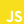

## 👋 Hello World! I'm [Gilead](https://gileadodo.xyz)

[](https://twitter.com/intent/follow?original_referer=https%3A%2F%2Fgithub.com%blur94&screen_name=balmofcodes)

<p align="left">  </p>

```typescript
const developer = {
  stack: ["TypeScript", "JavaScript", "Next.js", "React", "Node.js", "MongoDB"],
  passion: "Crafting pixel-perfect and performance-driven web experiences",
  motto: "Building the future, one line at a time",
  currentlyLearning: "React Native and Go Lang",
};

console.log(`Let's collaborate and create something extraordinary! 🚀`);
```

### Connect with me:

[][X] &nbsp;
[][linkedin] &nbsp;
[][instagram]

### Languages and Tools:

 &nbsp;
 &nbsp;
 &nbsp;
 &nbsp;
 &nbsp;
 &nbsp;
 &nbsp;
 &nbsp;
 &nbsp;
 &nbsp;
 &nbsp;
 &nbsp;


### Project:

[Metrix](https://metrix.gileadodo.xyz)\
[BookHub](https://bookhub.gileadodo.xyz)\
[DigitalEsque](https://digitalesque-balm.vercel.app)\
[Tiketai](https://tiketai.vercel.app)\
[NextBalmMerce](https://nextbalmerce.vercel.app)

[instagram]: https://instagram.com/balmofcodes
[linkedin]: https://linkedin.com/in/gilead-odo
[X]: https://twitter.com/balmofcodes

<!---
blur94/blur94 is a ✨ special ✨ repository because its `README.md` (this file) appears on your GitHub profile.
You can click the Preview link to take a look at your changes.
--->
